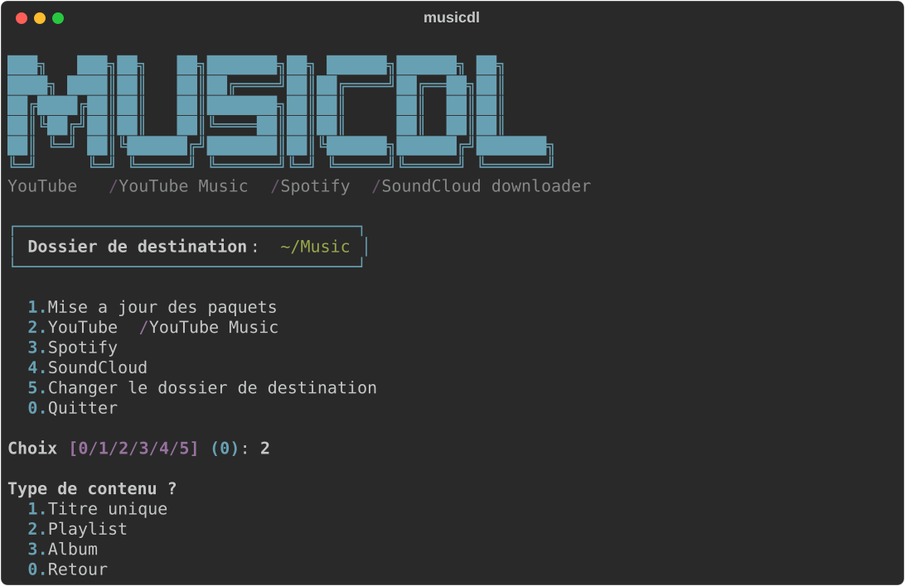

# musicdl

> 🇬🇧 English · [🇫🇷 Version française](README.fr.md)

<p align="center">
  
</p>

Interactive CLI that orchestrates `yt-dlp`, `spotdl` and `scdl` to download
music from **YouTube / YouTube Music / Spotify / SoundCloud** into a clean
`Artist/Album/N° - Title.mp3` tree, with deduplication, automatic retry on
HTTP 403 errors, `.m3u` generation for playlists and per-run history log.

## Features

- **Interactive menu** in the `theHarvester` style: pick a source, content type
  (track / playlist / album), format (MP3 / MP4 for YouTube), audio quality
  (best / 320 / 192 / 128 kbps).
- **Batch mode**: one URL, several pasted URLs, or a `.txt` file.
- **Destination folder** remembered in `~/.musicdl/config.json`, with a
  platform-adapted default (Windows/macOS/Linux/Termux).
- **Deduplication** via yt-dlp's `--download-archive` (one copy per video ID).
- **Automatic retry** on YouTube `HTTP 403` errors with a fallback player
  client (`--extractor-args youtube:player_client=default,web,mweb`).
- **`.m3u` generation** in each downloaded playlist folder, ready to be
  imported into Navidrome / Symfonium.
- **Aggregated recap** after every run (OK / skip / errors, per-URL breakdown).
- **Run history** in `~/.musicdl/history.log`.
- **Startup dependency detection**: unavailable sources are shown grayed out
  rather than crashing mid-download.

## Install

The install scripts handle **everything**: detect your OS, install the system
prerequisites (`uv`, `ffmpeg`, `deno`/`nodejs`, and `git` if missing), then
sync the project. Non-devs friendly.

### Windows

```powershell
git clone https://github.com/STAKHAN-M/musicdl.git
cd musicdl
Set-ExecutionPolicy -Scope Process Bypass -Force
.\install.ps1
```

The last line temporarily allows script execution for the current PowerShell
session only (no permanent policy change).

### macOS / Linux / Termux (Android)

```bash
git clone https://github.com/STAKHAN-M/musicdl.git && cd musicdl && ./install.sh
```

On **Termux**, don't forget to run `termux-setup-storage` (once) so downloads
land in the shared storage visible to music players. Spotify is unavailable
on Termux (pydantic-core has no Android wheel) — YouTube, YT Music and
SoundCloud work normally.

### Manual install (fallback)

If you'd rather install prerequisites yourself:

```bash
# Windows
winget install astral-sh.uv Gyan.FFmpeg DenoLand.Deno

# macOS
brew install uv ffmpeg deno

# Linux (Debian/Ubuntu)
curl -LsSf https://astral.sh/uv/install.sh | sh
sudo apt install ffmpeg
curl -fsSL https://deno.land/install.sh | sh

# Linux (Arch)
sudo pacman -S uv ffmpeg deno

# Termux
pkg install python ffmpeg nodejs uv git
```

Then, from the cloned repo:

```bash
uv sync --extra spotify     # or `uv sync` to skip Spotify
uv run musicdl
```

Or the classic pip + venv path:

```bash
python3.12 -m venv .venv
source .venv/bin/activate       # or .venv\Scripts\activate on Windows
pip install -e ".[spotify]"     # or `pip install -e .` to skip Spotify
musicdl
```

## Usage

```bash
uv run musicdl
# or, with an activated classic venv:
musicdl
```

On the first launch, the tool asks for a destination folder, then shows the
menu:

```
MUSICDL
  1. Update packages
  2. YouTube / YouTube Music
  3. Spotify                       [unavailable]  <- if spotdl is missing
  4. SoundCloud
  5. Change destination folder
  0. Quit
```

Each source then walks through:
`Content type → [YT format] → [audio quality] → URL source → Download → Recap`

## Output tree

```
<folder>/
├─ Artist/
│   └─ Album/
│       ├─ 01 - Track A.mp3
│       └─ 02 - Track B.mp3
└─ My Playlist/
    ├─ 001 - Artist - Track.mp3
    ├─ 002 - Artist - Track.mp3
    └─ My Playlist.m3u
```

## Project layout

```
src/musicdl/
├─ __init__.py          # main() entry point
├─ menu.py              # interactive menus + banner
├─ config.py            # ~/.musicdl/config.json + platform-adapted default
├─ history.py           # ~/.musicdl/history.log
├─ deps.py              # optional-dependency detection at startup
├─ runner.py            # streaming subprocess + OK/skip/err parsing + 403 detection
├─ m3u.py               # post-download .m3u generation for playlists
└─ backends/
    ├─ youtube.py       # yt-dlp wrapper (mp3/mp4, quality, 403 retry)
    ├─ spotify.py       # spotdl wrapper (optional extra)
    └─ soundcloud.py    # scdl wrapper
```

## Optional extras

Spotify is now an optional extra (avoids installing pydantic-core on
platforms that don't support it, notably Android/Termux).

```bash
uv sync --extra spotify              # with uv
pip install -e ".[spotify]"          # with pip
```

Without this extra, the "Spotify" menu entry appears grayed out and refuses
the selection with a clear message.

## Roadmap

- [x] Phase 0: scaffold, deps, structure
- [x] Phase 1: interactive CLI, per-source routing
- [x] Phase 2: 403 handling, dedup, `.m3u`, batch, audio quality
- [x] Phase 3: dependency guards, cross-platform install, Termux
- [ ] Phase 4: advanced batch, interrupted-run resume
- [ ] Phase 5 (optional): FastAPI backend + web UI + Navidrome/NAS integration

## Credits & dependency licenses

This project **does not perform** the downloads itself — it orchestrates
three excellent open-source tools.

| Tool | License | Authors / Project |
|---|---|---|
| [yt-dlp](https://github.com/yt-dlp/yt-dlp) | Unlicense (public domain) | yt-dlp contributors (youtube-dl fork) |
| [spotdl](https://github.com/spotDL/spotify-downloader) | MIT | spotDL contributors |
| [scdl](https://github.com/flyingrub/scdl) | GPL-2.0 | Nicolas Casajus (`flyingrub`) and contributors |
| [typer](https://github.com/tiangolo/typer) | MIT | Sebastian Ramirez (`tiangolo`) |
| [rich](https://github.com/Textualize/rich) | MIT | Will McGugan / Textualize |
| [hatchling](https://github.com/pypa/hatch) | MIT | PyPA / Ofek Lev |

**About scdl (GPL-2.0)**: scdl is declared as a dependency (installed by
`uv sync`) and invoked as a subprocess (`python -m scdl`). It is neither
statically linked nor redistributed by this project, which remains compliant
with GPL-2.0 (mere aggregation). Any redistribution _bundling_ scdl would
need to comply with the GPL.

System tools used but not shipped:

| Tool | License | Project |
|---|---|---|
| [ffmpeg](https://ffmpeg.org/) | LGPL / GPL depending on build | FFmpeg team |
| [deno](https://deno.land/) | MIT | Deno Land Inc. |
| [Node.js](https://nodejs.org/) | MIT | OpenJS Foundation |

## License

**This project's** code is released under the [MIT License](LICENSE).
See the _Credits & licenses_ section above for dependency licenses.

## Legal / usage

Strictly **personal-use** tool. Using yt-dlp / spotdl / scdl on freely
accessible content sits in a tolerated but ToS-noncompliant zone with respect
to the platforms. The user alone is responsible for complying with local
copyright laws and the terms of service of the concerned platforms.
